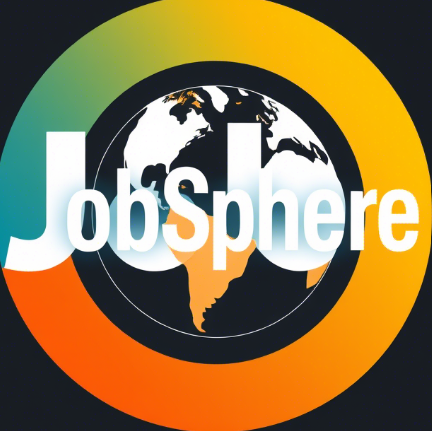
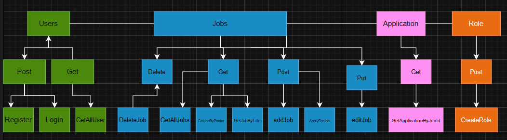

<!DOCTYPE html>
<html lang="en">
  <head>
    <meta charset="UTF-8" />
    <meta name="viewport" content="width=device-width, initial-scale=1.0" />
    <h2 >JobSphere</h2>
    <link rel="stylesheet" href="style.css" />
  </head>
  <body>
    

      
      <h2 aligntext="center" class="title">JobSphere</h2>
    

    <h3 align-text="center" class="tableOfContents">Table Of Contents</h3>
    <ul>
      <li>About</li>
      <li>Getting Started</li>
      <li>Usage</li>
      <li>Built Using</li>
      <li>User Story</li>
      <li>Data Flow</li>
      <li>Guided By</li>
    </ul>
    <h3 class="about">About:</h3>
    

      Whether you’re a job seeker hunting for your dream role or a company on
      the lookout for talent, we’ve got your back. Our platform is built to make
      job hunting way easier (and even fun!).
    

    <h3 class="about">Getting Started:</h3>
    

      These instructions will get you a copy of the project up and running on
      your local machine for development and testing purposes.
    

    <h3>Prerequisites:</h3>
    

      - Visual Studio Code follow this
      <a href="https://code.visualstudio.com/download">link</a> to install.
    

    

      - Git Bash follow this <a href="https://git-scm.com/downloads">link</a> to
      install.
    

    

      - MongoDB follow this
      <a href="https://www.mongodb.com/docs/manual/installation/">link</a> to
      install.
    

    

      - Node.js follow this <a href="https://nodejs.org/en/download">link</a> to
      install.
    

    <h3>Installing:</h3>
    
1. Clone the repo to your local machine using git bash:

    

      git clone https://github.com/C14-BelalAbandah/MERAKI_Academy_Project_4.git
    

    
2. Install packeges repeat this step in backend and frontend folder:

    
npm i

    
3. Run server using git bash inside backend folder:

    
npm run dev

    
4. Run application using git bash inside frontend folder:

    
npm run start

    <h4><strong> Naw app ready to use</strong></h4>
    <h3>Usage:</h3>
    
- You have to register to apply for job

    
- You can click on the *Jobs* to go the jobs

    
- You can search for any job

    

      - If yor are a recruiter, you can add jobs, and check all applications on
      your jobs
    

    <h3>Built Using:</h3>
    

      Database: <a href="https://www.mongodb.com">MongoDB</a>
    

    

      Server Framework: <a href="https://expressjs.com">Express JS</a>
    

    

      Web Framework: <a href="https://https://reactjs.org">React JS</a>
    

    

      Server Environment: <a href="https://nodejs.org/en">Node JS</a>
    

    <h3>User Story:</h3>
    
<a href="https://trello.com/b/qLZoHCDH/project-4">Trello</a>

    <h3>Data Flow:</h3>
    
    <h3>Guided By:</h3>
    

      This project is guided by ©️
      <a href="https://www.meraki-academy.org">MERAKI Academy</a>
    

  </body>
</html>
